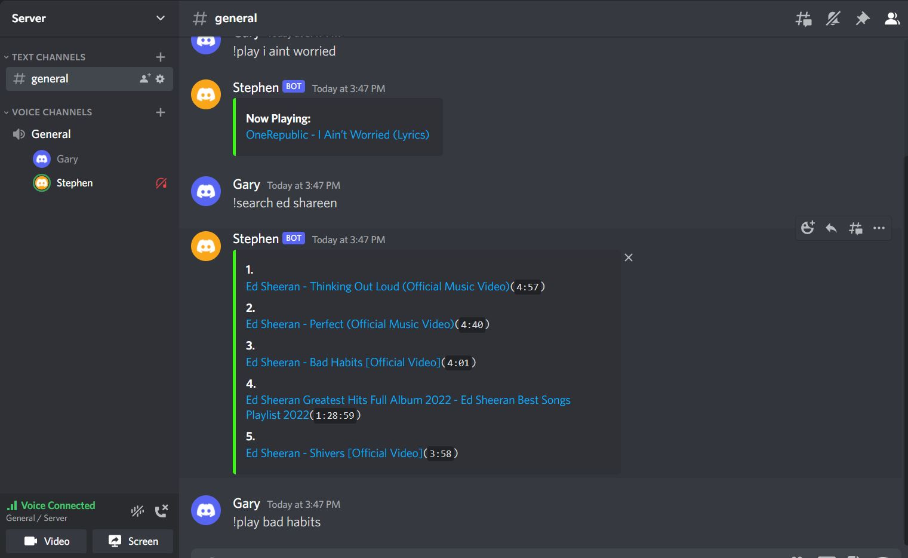

# Introduction
*  Start the program using `node .`
*  Rename the template.json file into hidden.json and replace it with the token to access your own discord bot account.
*  The program will log to the console once you are able to successfully log in.

# Description

## Notes
* This is a fully functional bot able to play Youtube videos.
* Command list and functionality can be seen with the command 'help'.
    * All commands are separated into files in the commands folder.

# Technologies
<<<<<<< HEAD

=======

>>>>>>> a6e854f59db6bfd7535225e2a7a059642e08704b
